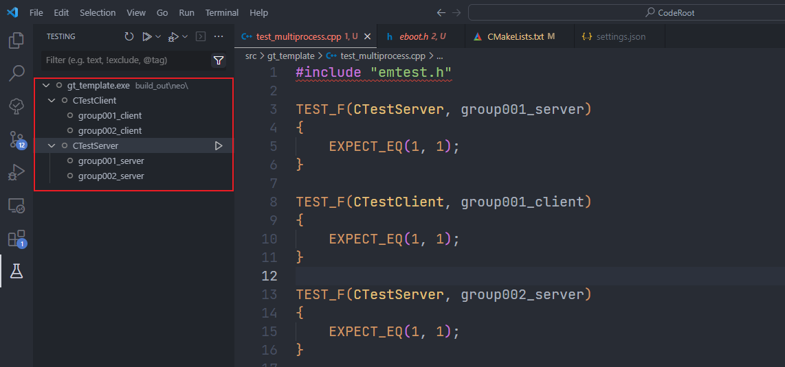

# EMTest

## 💬 介绍

EMTest（Easy Multi-process Testing Tool）是一款简单的多进程测试管理工具，基于 [VSCode Testing API](https://code.visualstudio.com/api/extension-guides/testing)。如果发现项目本身的 BUG，或者有任何建议，欢迎在 GitLab 提交[Issue](https://gitlab.enjoymove.cn/longwei.zhang/emtest/-/issues)。

**EMTest的核心思想是一个进程只执行一个测试用例。**核心实现是GTest提供的`--gtest_list_tests`和`--gtest_filter`参数。通过这两个参数可以很容易实现展示所有测试用例和执行特定的测试用例。

通过VSCode提供的UI界面可以实现测试用例的分组展示，当用户选择执行某个分组时，EMTest会同时启动多个进程来分别执行不同的单个测试用例，对于每个进程的测试报告可以通过Python 脚本进行合并和展示。这就是多进程测试的整个流程。


## ✨ 特性

- 📌 开箱即用，无需配置，自动检测工作区内的所有 Gtest 测试程序。
- 🚀 测试用例分组执行，组内并行，组间串行
- 💪 可以自由选取一个或多个测试用例执行。
- 🐆 能够添加不同目录下的多个测试程序，对于每个测试程序指定运行参数。
- 🖍️ 具有程序输出控制台，能够显示日志打印和测试结果。
- ✔️ 提供的高级配置，定制程序执行过程，上手容易
- 🚩 根据测试结果一键跳转到源程序进行调试（需要使用最新版的GTest）

## 👀 安装

目前该扩展并没有上线到 VSCode 扩展商店，所以只能使用打包好的程序，进行离线安装。


## 🫰快速开始

### 下载Gtest模板工程

在版本发布说明中，附有GTest工程模板下载链接：[gt-template](https://gitlab.enjoymove.cn/longwei.zhang/emtest/-/releases)。

### 生成解决方案

将`gt_template`放在`CodeRoot`的`src`目录下，并生成Visual Studio解决方案，注意需要将`gt_template`下的两个xml配置文件拷贝到`CodeRoot`下的`build_out/neo/`目录下。

打开解决方案，将`gt_template`生成可执行程序。


### 使用VSCode打开

使用安装EMTest的VSCode打开`CodeRoot`文件夹，EMTest 会自动检测该文件夹及其子文件夹下的所有测试程序。下图是EMTest所在位置以及重要的按钮。


如果没有编写配置文件，EMTest会以GTest的TestFixture进行分组，效果如下图所示。




### 测试用例分组

> **注意：编写GTest测试用例时，即使是在不同的TestFixture内，也要保证测试用例名全局唯一，因为EMTest是根据测试用例名来进行分组。**

如果想对测试用例进行分组，需要通过编写EMTest的配置文件。

在工作区的根目录下新建`.vscode`目录，并在里面新建配置文件`settings.json`，添加以下内容，在`gt_template`模板工程内也提供了该文件。

```json
{
    "emtest.cpp.test.advancedExecutables": [
        {
            "pattern": "build_out/neo/*",
            "gtest": {
                "prependTestRunningArgs": [],
                "testGrouping": {
                    "groupByRegex": {
                        "label": "EMTest001",
                        "regexes": [
                            "group001_client",
                            "group001_server",
                        ],
                        "groupUngroupedTo": "other"
                    }
                }
            }
        },
        {
            "pattern": "build_out/neo/*.exe",
            "gtest": {
                "prependTestRunningArgs": [],
                "testGrouping": {
                    "groupByRegex": {
                        "label": "EMTest002",
                        "regexes": [
                            "group002_client",
                            "group002_server"
                        ],
                        "groupUngroupedTo": "other"
                    }
                }
            }
        }
    ]
}
```

> 注意，`.vscode/settings.json`是固定编写配置文件的地方，请不要随意更改文件夹和文件名。

`emtest.cpp.test.advancedExecutables`这个配置项，可以设置测试程序所在位置以及一些其他信息。它的值是一个数组，每个一个元素可以设置一个测试程序的相关信息。也可以利用通配符的形式，同时设置多个测试程序。

其中，每个元素的`pattern`属性必须设置，其他都是可选项。

| 属性                     | 描述                                             |
| ------------------------ | ------------------------------------------------ |
| `pattern`                | 测试程序的路径。支持相对路径、绝对路径和通配符。 |
| `gtest`                  | 测试框架 gtest 相关配置                          |
| `prependTestRunningArgs` | 测试程序的执行参数                               |
| `groupByRegex`           | 根据正则表达式匹配规则进行分组                   |
| `label`                  | 分组名称                                         |
| `regexes`                | 匹配规则                                         |
| `groupUngroupedTo`       | 将未匹配到的测试用例放在 other 分组              |


## 🙏 高级进阶

更多高级配置可以参考[Config 配置说明](https://gitlab.enjoymove.cn/longwei.zhang/emtest/-/blob/master/docs/config.md)
